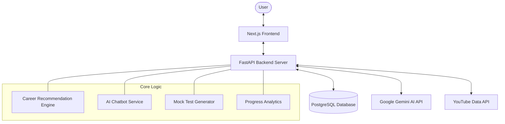

# CarreonX — AI-Powered Career Guidance System
## [Your Name]
### [College Name]
#### [Guide Name]

---

## 1. Abstract
CarreonX is an advanced, AI-driven career intelligence platform designed to bridge the gap between students' current skills and their professional goals. In an increasingly complex job market, students often face "analysis paralysis" when choosing a career path or identifying necessary skills. 

This project addresses these challenges by providing:
1.  **Personalised Roadmaps**: Step-by-step learning paths generated by Google Gemini Pro AI.
2.  **Skill Gap Analysis**: Identifying exactly what a user needs to learn.
3.  **AI Mentor Chat**: A 24/7 assistant for career and technical queries.
4.  **Mock Testing**: Validating knowledge through AI-generated quizzes.

The system is built using **FastAPI** for the backend, **Next.js** for the frontend, and uses **PostgreSQL** for scalable data management, resulting in a premium, production-ready solution for career guidance.

---

## 2. Introduction
**The Problem**:
Millions of students and graduates struggle with two primary questions: *"What career should I choose?"* and *"How do I get there?"*. Traditional career counseling is often expensive, inaccessible, or relies on outdated static data. Consequently, many students waste time on irrelevant courses or fail to acquire industry-standard skills.

**The Solution**:
CarreonX leverages Generative AI (Google Gemini) to provide a dynamic, real-time guidance system. Unlike static career portables, CarreonX adapts to the user's existing skills and target career, generating bespoke roadmaps that evolve with the user's progress. By integrating an AI chatbot, learning resources (YouTube API), and mock tests, it offers a complete "Mastery-as-a-Service" experience.

---

## 3. Objectives
The primary objectives of CarreonX are:
- **Automation of Career Mapping**: To replace manual research with AI-generated timelines and skill milestones.
- **Skill-to-Goal Alignment**: To bridge the "Skill Gap" by comparing user input with industry requirements.
- **Continuous Learning Support**: To provide 24/7 mentorship via an AI chatbot.
- **Validation of Mastery**: To offer subject-specific mock tests for self-assessment.
- **Progress Visibility**: To track and visualize user growth through a premium analytics dashboard.

---

## 4. System Architecture

---

## 5. Technologies Used
### Backend
- **FastAPI**: A modern, high-performance web framework for building APIs with Python. Used for its speed and native support for asynchronous operations.
- **SQLAlchemy (ORM)**: For database modelling and transaction management.
- **Pydantic**: For data validation and settings management.

### Database
- **PostgreSQL**: Robust, enterprise-grade relational database for tracking user profiles, results, and chat history.
- **SQLite**: Used during the development phase for rapid prototyping.

### Frontend
- **Next.js 16 (App Router)**: React-based framework for high-performance frontend with server-side rendering support.
- **TypeScript**: Ensuring type safety and fewer runtime errors.
- **Vanilla CSS**: Custom styling for a premium "Glassmorphism" UI/UX.

### AI & External Services
- **Google Gemini Pro 1.5**: Leading LLM used for roadmap generation, chatbot logic, and mock test creation.
- **YouTube API Integration**: To fetch curated video resources for skill milestones.

---

## 6. Modules Explanation
- **A. Authentication Module**: Secure Login and Signup using hashed passwords and session management.
- **B. Profile Management**: A 3-step onboarding wizard to capture user career domains (e.g., AI Engineering, Web Dev) and current skillsets.
- **C. AI Career Roadmap**: A core engine that analyzes the user's gap and produces a multi-step timeline of skills to master.
- **D. AI Mentor Chatbot**: A context-aware chat system that helps students with direct technical or career-related questions.
- **E. Mock Test System**: Subject-speciific quiz generator that provides instant feedback and scoring.
- **F. Analytics Dashboard**: A centralized hub showing "Skills Mastered," "Average Test Scores," and "Roadmap Completion."

---

## 7. Working of Project
1.  **Onboarding**: The user signs up and provides their "Target Career" and "Current Skills."
2.  **Analysis**: The backend sends this data to the Gemini AI API, which returns a structured "Skill Gap" report.
3.  **Pathfinding**: The system generates a roadmap and fetches top-tier YouTube tutorials for each skill.
4.  **Learning & Support**: The user follows the roadmap and asks the AI Mentor for detailed explanations of complex topics.
5.  **Validation**: Once confident, the user takes a "Mock Test" for a specific skill.
6.  **Progress**: All test results and profile updates are logged in the database and displayed on the Analytics page.

---

## 8. Screenshots
- **Landing Page**: Premium hero section with AI roadmap preview.
- **Dashboard**: KPI cards for "Skills Mastered" and "Learning Path."
- **AI Roadmap**: Interactive timeline with YouTube resources.
- **AI Chatbot**: Real-time conversation interface with "AI Mentor."
- **Mock Test**: Interactive quiz UI with score ring results.
- **Onboarding**: Multi-step wizard UI.

---

## 9. Results
- **Accurate Recommendations**: Successfully generates specific, industry-aligned career paths.
- **Interactive Mentorship**: Chatbot provides highly relevant technical answers with code snippets.
- **Data Persistence**: All user progress is securely saved and retrievable across sessions.
- **High Performance**: API response times under 2 seconds for AI-enhanced queries.

---

## 10. Conclusion
The CarreonX project successfully demonstrates how Generative AI can democratize quality career coaching. By centralizing roadmaps, resources, and mentorship in a single premium interface, it reduces student confusion and accelerates the journey to professional mastery. The transition from local SQLite to production PostgreSQL ensures the system is ready for real-world traffic.

---

## 11. Future Scope
- **LLM Upgrades**: Integrating multi-modal AI (Gemini Flash) for faster responses.
- **Resume Parsing**: Allowing users to upload a PDF resume for automatic skill extraction.
- **Job Matching**: Connecting users directly with job listings that match their completed roadmap.
- **Mobile Integration**: Building a companion Flutter or React Native app for on-the-go learning.
